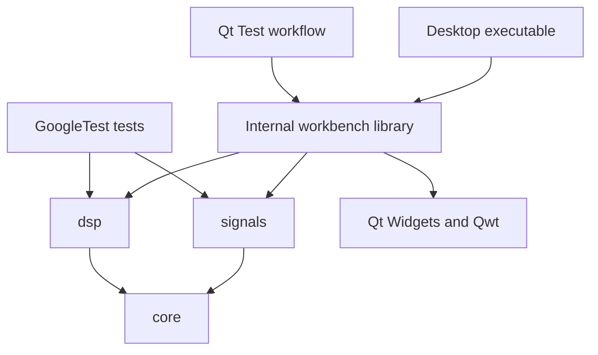

# Architecture decisions

## Small libraries with explicit dependencies

The GUI coordinates generation and analysis. Domain libraries have no Qt headers,
event-loop requirements, global state, or knowledge of widgets. Each operation
receives explicit inputs and returns owned values. Headless CMake configuration
does not even search for Qt or Qwt.

GUI targets use `QT_NO_KEYWORDS` and Qt's explicit `Q_SIGNALS`/`Q_SLOTS` spellings.
This prevents Qt's optional `signals` macro from colliding with the C++ domain namespace.

Three small engineering targets are slightly more CMake work than one monolithic
library, but make dependency direction visible and prevent accidental GUI coupling.
Namespaced public headers and target-level include paths provide stable boundaries
without claiming a stable ABI in v0.1. C++20 provides `std::span`, bit utilities,
and mathematical constants without requiring a newer language baseline.

We use `signals/` and `dsp/` directly rather than `modules/signals/` plus a separate
shared `signals/` tree. There is no demonstrated need for both layers yet. Empty
`math/`, `simulation/`, and future domain directories would not enforce useful
boundaries. Add them only when implementations and shared requirements exist.

## Desktop and plotting

Qt Widgets supports traditional engineering controls and predictable layouts in
C++. Qt Quick is a reasonable future alternative for touch/animation, but would
introduce a second UI language and a different rendering stack now. Our numerical
interfaces support either choice.

Qwt handles scientific axes, curves, and interactive zoom. A small `PlotWidget`
adapts owned numerical results to Qwt. This avoids building a plotting toolkit.
[Qt Charts is deprecated](https://doc.qt.io/qt-6/qtcharts-overview.html), and Qt
Graphs would bring a Qt Quick rendering path; neither is necessary for this slice.
Fedora's Qt 6 Qwt package is found through `pkg-config`.

The internal `openece_workbench` target allows GUI integration tests to use the
same implementation as the executable. It is not a public extension API.

## Ownership and errors

`SampledSignal` owns `std::vector<double>` and exposes a read-only span. Construction
validates finite samples and positive rate with a representable duration. A span
does not extend lifetime; it is invalid after its owning record is destroyed or
reassigned. Borrowing samples from an rvalue is prohibited to catch accidental
temporary lifetimes. Copying records copies values; moving transfers storage.
Treat moved-from records as suitable only for destruction or reassignment.

The result structs are plain owned values, not an abstract data hierarchy.
`AmplitudeSpectrum` metadata and magnitudes are produced together; callers should
preserve their relationship. Physical units, timestamps, channel layouts, and
complex signal records need a future design driven by actual consumers.

Invalid domain inputs throw `std::invalid_argument`; sample indexing errors throw
`std::out_of_range`; detected FFT arithmetic overflow throws `std::overflow_error`.
Allocation errors can also propagate. The GUI converts exceptions to a visible
message and clears stale plots. No domain code displays dialogs or logs globally.

Qt parents own widgets and delete them with the window. Member pointers only
observe those widgets. Qwt's plot dictionary owns attached curve/grid items;
its canvas owns the zoomer. Qwt's copying
[`setSamples` overload](https://qwt.sourceforge.io/class_qwt_plot_curve.html)
prevents plots from retaining pointers into temporary vectors.

## Algorithm and execution choices

An iterative radix-2 Cooley–Tukey FFT offers educational value: bit reversal,
butterfly operations, complex phase factors, and O(N log N) scaling are visible.
Tests use a separate direct DFT and analytical cases. FFTW or another optimized
backend is an option when arbitrary lengths, throughput, or streaming measurements
justify it. Numerical correctness and conventions must remain the same across backends.

Generation and FFT run synchronously on explicit button clicks. The desktop limit
of 65,536 samples bounds allocation and processing; a numerical library limit of
1,048,576 also prevents unbounded requests in this release. These are documented
resource policies, not mathematical restrictions of sampling. Real-time or larger
workloads should introduce worker execution with cancellation after measuring them.

## Extension rule

Add the next algorithm as a Qt-independent function or focused class with tests.
Then connect it in the GUI. A separate experiment/controller model is warranted
when saving, multiple views, or multiple operations need shared state. A graph
engine and runtime plugins should follow repeated composition needs, rather than
precede them. Circuits and SDR must not acquire dependencies on generator widgets.
