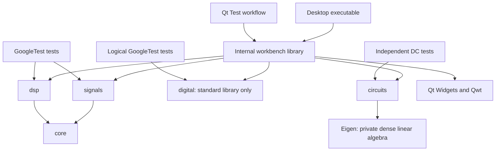

# Architecture decisions

## Small libraries with explicit dependencies

The GUI coordinates generation and analysis. Domain libraries have no Qt headers,
event-loop requirements, global state, or knowledge of widgets. Each operation
receives explicit inputs and returns owned values. Headless CMake configuration
does not even search for Qt or Qwt.

GUI targets use `QT_NO_KEYWORDS` and Qt's explicit `Q_SIGNALS`/`Q_SLOTS` spellings.
This prevents Qt's optional `signals` macro from colliding with the C++ domain namespace.

Five small engineering targets are slightly more CMake work than one monolithic
library, but make dependency direction visible and prevent accidental GUI coupling.
Namespaced public headers and target-level include paths provide stable boundaries
without claiming a stable ABI in v0.1. C++20 provides `std::span`, bit utilities,
and mathematical constants without requiring a newer language baseline.

We use `signals/` and `dsp/` directly rather than `modules/signals/` plus a separate
shared `signals/` tree. There is no demonstrated need for both layers yet. Empty
`math/`, `simulation/`, and future domain directories would not enforce useful
boundaries. Add them only when implementations and shared requirements exist.

## Desktop and plotting

Qt Widgets supports traditional engineering controls and predictable layouts in
C++. Qt Quick is a reasonable future alternative for touch/animation, but would
introduce a second UI language and a different rendering stack now. Our numerical
interfaces support either choice.

Qwt handles scientific axes, curves, and interactive zoom. A small `PlotWidget`
adapts owned numerical results to Qwt. This avoids building a plotting toolkit.
[Qt Charts is deprecated](https://doc.qt.io/qt-6/qtcharts-overview.html), and Qt
Graphs would bring a Qt Quick rendering path; neither is necessary for this slice.
Fedora's Qt 6 Qwt package is found through `pkg-config`. Both platforms consume
`Qwt::Qwt`: Windows uses the explicit bootstrap's configuration-specific shared
library/import-library map. Qt and GoogleTest use standard CMake package discovery.
Windows dependency acquisition and runtime deployment are separate PowerShell
scripts; ordinary CMake configure never uses the network. Compiler flags remain
private to project targets. See [Windows build design](windows.md) for the pinned
toolchain and portable ZIP deployment. Eigen is acquired separately for the DC solver.

The internal `openece_workbench` target allows GUI integration tests to use the
same implementation as the executable. It is not a public extension API.

## Ownership and errors

`SampledSignal` owns `std::vector<double>` and exposes a read-only span. Construction
validates finite samples and positive rate with a representable duration. A span
does not extend lifetime; it is invalid after its owning record is destroyed or
reassigned. Borrowing samples from an rvalue is prohibited to catch accidental
temporary lifetimes. Copying records copies values; moving transfers storage.
Treat moved-from records as suitable only for destruction or reassignment.

The result structs are plain owned values, not an abstract data hierarchy.
`AmplitudeSpectrum` metadata and magnitudes are produced together; callers should
preserve their relationship. Physical units, timestamps, channel layouts, and
complex signal records need a future design driven by actual consumers.

Invalid Signals/DSP inputs throw `std::invalid_argument`; sample indexing errors throw
`std::out_of_range`; detected DSP arithmetic overflow throws `std::overflow_error`.
Allocation errors can also propagate. The GUI converts exceptions to a visible
message and clears stale plots. No domain code displays dialogs or logs globally.

Qt parents own widgets and delete them with the window. Member pointers only
observe those widgets. Qwt's plot dictionary owns attached curve/grid items;
its canvas owns the zoomer. Qwt's copying
[`setSamples` overload](https://qwt.sourceforge.io/class_qwt_plot_curve.html)
prevents plots from retaining pointers into temporary vectors.

## Algorithm and execution choices

An iterative radix-2 Cooley–Tukey FFT offers educational value: bit reversal,
butterfly operations, complex phase factors, and O(N log N) scaling are visible.
Tests use a separate direct DFT and analytical cases. FFTW or another optimized
backend is an option when arbitrary lengths, throughput, or streaming measurements
justify it. Numerical correctness and conventions must remain the same across backends.

Generation and FFT run synchronously on explicit button clicks. The desktop limit
of 65,536 samples bounds allocation and processing; a numerical library limit of
1,048,576 also prevents unbounded requests in this release. These are documented
resource policies, not mathematical restrictions of sampling. Real-time or larger
workloads should introduce worker execution with cancellation after measuring them.

## Spectral windows and phase entry (v0.2)

`dsp/window.hpp` exposes a two-value `Window` enum and a coefficient generator.
`amplitude_spectrum(signal, window)` applies those weights in its own complex buffer
before zero-padding. The default is Rectangular. `fft()` knows nothing about windows,
and the original `SampledSignal` remains reusable by the time plot or other operations.
The spectrum carries its window choice and coherent gain as result metadata.

Periodic Hann and singleton behavior are explicit numerical contracts in `numerics.md`.
There is no window class hierarchy, plugin interface, or new dependency. The coefficient
function makes analytical testing possible without involving the FFT or GUI.

Phase-unit selection belongs to `SignalsDspView`. A `QLineEdit` retains pending and
invalid text; `phase_input` owns the bounded decimal/pi grammar and conversion
formatting within the GUI module. Generate and unit switching use the same parser.
A previous-unit flag lets text be parsed before changing the selector's unit; on
failure the selector rolls back with signals blocked. The π button inserts text
using the line edit's cursor and selection. The signal API continues to take
radians; no expression parser or unit enumeration enters the engineering library.

## Convolution and FIR composition (v0.3)

Two public headers extend `OpenECE::dsp`: `convolution.hpp` provides
`convolve_full(span, span)`, and `fir.hpp` provides `FirCoefficients`,
`apply_fir_full(signal, coefficients)`, `design_lowpass(taps, cutoff_hz, fs)`,
and `frequency_response(coefficients, fs, points)`. No existing numerical API,
window formula, or dependency edge changes. `SampledSignal` remains a finite,
real record beginning at zero, which also describes full causal FIR output.

`FirCoefficients` validates and owns a vector, exposes a const lvalue-only span,
and performs no normalization. Copies own their data; moves transfer it. As with
signals, use moved-from objects only for destruction or reassignment. Coefficients
have no rate: their Hz interpretation belongs to the application rate. The low-pass
designer uses Hz and a rate to build taps, and the GUI redesigns them on Generate.
Only that designer normalizes to unity DC gain. Arbitrary taps need not be symmetric
or have a frequency-independent group delay.

Convolution is an input-side direct accumulation with zero extension and exactly
N+M−1 samples. Filtering wraps its owned vector in a new `SampledSignal` at the
input rate. There is no implicit crop or timing metadata attached to the record.
FIR delay is a property of the coefficients, explained separately in the GUI.
The designed symmetric filter has delay (M−1)/2 samples, left uncompensated.

`FirFrequencyResponse` owns complex values and carries the rate. Its `bin_width_hz()`
is (fs/2)/(P−1); callers must preserve the vector/metadata relationship. The response
uses a direct trigonometric sum with real DC/Nyquist endpoint sums, independently
of `fft()` and `amplitude_spectrum()`. This supports any allowed grid length and
avoids confusing signal amplitude scaling with filter gain.

Full output increases the observation length; each branch uses its own unchanged
`amplitude_spectrum` call and metadata. `SignalsDspView` coordinates local owned values
and passes copied samples to `PlotWidget`. The plot adapter lazily owns a second
curve for comparison, shares axes across both datasets, and accepts independent
frequency grids. Filter Off clears/hides comparison data and restores the existing
single-curve path. A separate response tab uses a linear Hz axis and dB gain axis.
The controls scroll on smaller windows; no model, graph engine, or worker framework
is introduced for this one operation.

The tradeoff is explicit O(NM) convolution and O(MP) response evaluation. Each is
bounded at 64,000,000 products; output, coefficients and response-point counts
also use the existing 1,048,576 resource bound. The GUI restricts taps to 511,
response points to 1025, and full output to 65,536. Calculations remain synchronous,
with temporary buffers and Qwt copies. These bounds are not latency guarantees.
A worker/cancellation path, optimized convolution, and response caching should
follow measurements and actual workload needs, not precede them.

## Digital Logic and domain composition (v0.4)

`OpenECE::digital` is independent of all signal libraries and Qt. Its editable
`CircuitDefinition` owns primary inputs, gates and output references. `Circuit`
compiles an owned validated snapshot with stable node IDs, resolved indices and
an iterative deterministic topological order. Evaluation and truth tables require
that snapshot. The draft cannot mutate a compiled circuit. Results own values in
declaration order; spans are only borrowed during calls. See [digital-logic.md](digital-logic.md)
for the API, exact naming rules, gate semantics, cycle diagnostics and limits.

`MainWindow` now only composes a sidebar and persistent stacked domain views.
`SignalsDspView` contains the previous signal controls, generation, plots and help;
its calculation path is unchanged. `DigitalLogicView` owns a possibly invalid draft
and input assignments. Qt parents own each page and its widgets. Each explicit
Evaluate/Table action constructs a local validated circuit; failed validation
leaves the draft visible while clearing results. This small bounded editor does
not need a separate generic controller or shared simulation hierarchy. A future
schematic editor can produce the same core definition without changing evaluation.

Two-state values and one driver per source fit v0.4. Explicit references support
fan-out without a net-resolution layer. Cached topological ordering rejects all
cycles rather than trying fixed points; diagnostics report blocked gates without
claiming exact cycle membership. Truth tables cap inputs before exponential
arithmetic and retain only primary inputs/outputs. Name and graph bounds are
centralized in the digital core; the GUI imposes smaller bounds for synchronous use.
The v0.4 API contains no scheduler, buses or sequential placeholders. The v0.5
timing layer below is independent of instantaneous evaluation.

## Digital timing and sequential simulation (v0.5)

`openece::digital::timing` extends the same standard-library-only target with
`TimedCircuitDefinition`, validated `TimedCircuit`, and owned `Simulation` sessions.
The existing `Circuit::evaluate()` and truth-table code are unchanged. Gate Boolean
semantics are reused, while timing state, pending deliveries and captured storage
state live only in the new session. A separate typed variant describes delayed
gates, SR/D latches and edge-triggered D flip-flops. There is no generic device,
HDL, bus or analog simulator abstraction.

Graph validation cuts dependencies at storage outputs and topologically orders
only gate-to-gate dependencies. This supports storage feedback without permitting
pure combinational loops. Initialization settles those gates using explicit input
and Q values; it makes no power-up claim. A deterministic priority queue processes
whole timestamp batches, then evaluates affected elements once in declaration
order. All delays are positive, so new deliveries cannot recurse at the same time.
Generation tokens implement gate inertia; storage deliveries preserve capture
order independently of visible Q. [Timing contracts](digital-timing.md) define the
exact-delay pulse boundary, pre-batch D sampling, failure and resource semantics.

`DigitalWorkspace` composes persistent Combinational and Timing / Sequential tabs.
The former retains its existing editor and tests. A one-way copy action validates
and copies its draft with an explicit gate delay. `TimingView` owns editable table
cells and constructs a new validated session on Run/Step. Edits discard the old
session and its results. A zero-interval QTimer advances bounded batches; it is a
UI scheduling mechanism, never a simulated clock. `TimingDiagramWidget` uses Qwt
owned curve samples for right-continuous traces, separately from the DSP adapter.

The implementation favors inspectable correctness over throughput: each timestamp
copies visible state, scans node changes and affected elements, and snapshots copy
traces. Queue, work and trace budgets cap resources, and the GUI uses smaller caps.
There is no worker thread or hard latency guarantee. A future performance change
should be measurement-driven and preserve the documented deterministic semantics.

## Extension rule

Add the next algorithm as a Qt-independent function or focused class with tests.
Then connect it in the GUI. A separate experiment/controller model is warranted
when saving, multiple views, or multiple operations need shared state. A graph
engine and runtime plugins should follow repeated composition needs, rather than
precede them. Circuits and SDR must not acquire dependencies on generator widgets.

## Circuit Analysis (v0.6)

`OpenECE::circuits` owns a physical terminal model independent of SampledSignal and
Digital Logic. Its IDs, names, drafts, validated snapshots and owned DC results
have no Qt/Eigen types in their public representation. `Circuit` construction
validates structure; `solve_dc` separately diagnoses electrical/numerical failures
through structured `CircuitError` codes and relevant IDs. No global state is used.

OpenECE owns MNA indexing, stamps and sign conventions. Resistor/voltage-source
connectivity establishes reference; current-source edges do not. Voltage-source
forests distinguish inconsistent loops from redundant constraints, both rejected
because source currents must be unique. Private Eigen FullPivLU operates on the
explicitly equilibrated dense matrix; OpenECE checks rank/conditioning and original
matrix plus physical branch residuals. A home-grown production factorization and
sparse framework are unnecessary at the centralized 191-unknown cap.

Fedora uses system Eigen; Windows adds a pinned, verified header-only bootstrap
installation. Normal configure remains offline and no Eigen DLL is needed.
MainWindow gains only a Circuits navigation item and persistent CircuitsView;
other domain implementations remain unchanged. The view owns invalid editable
widget state, converts prefixes to SI only on parsing, and clears results on edits.
See [Circuit Analysis contracts](circuit-analysis.md) for all policies and tradeoffs.
