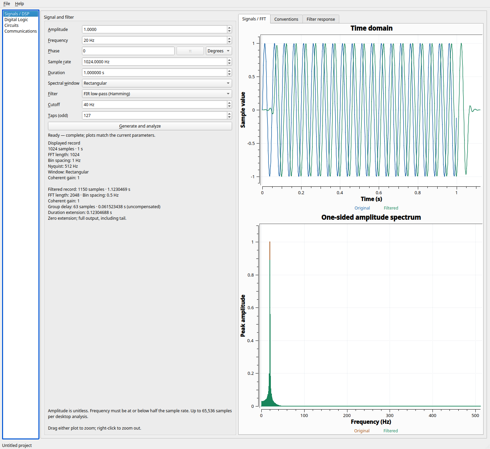
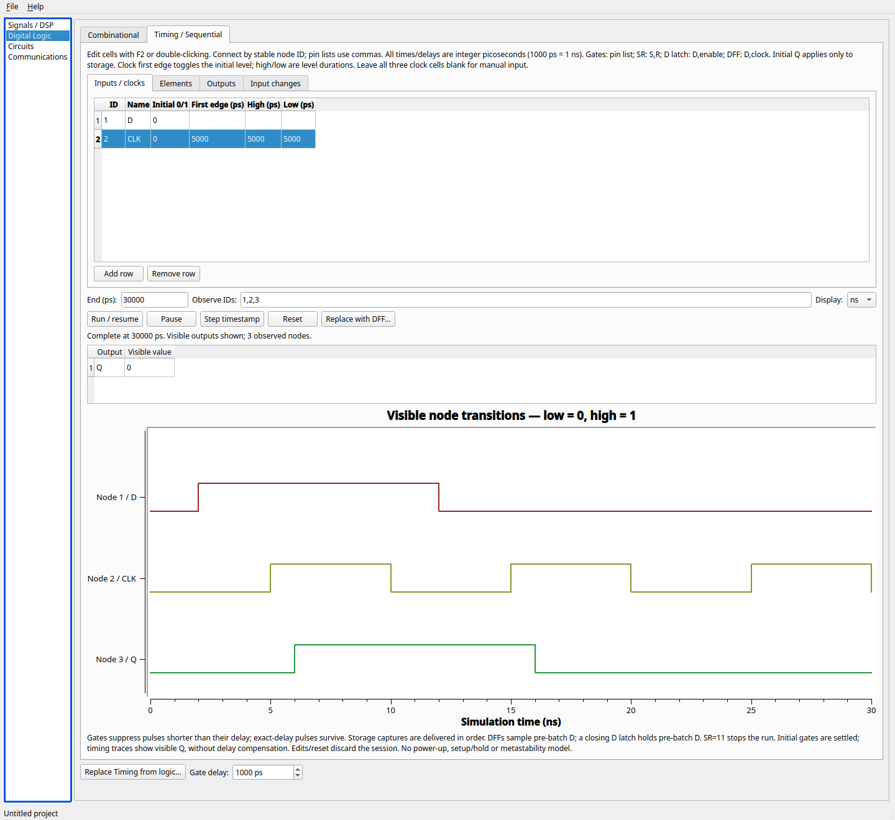
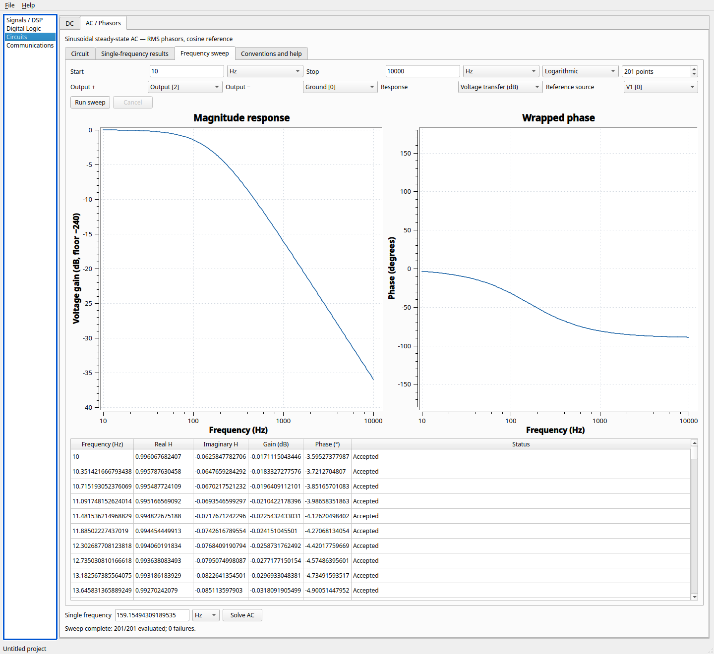
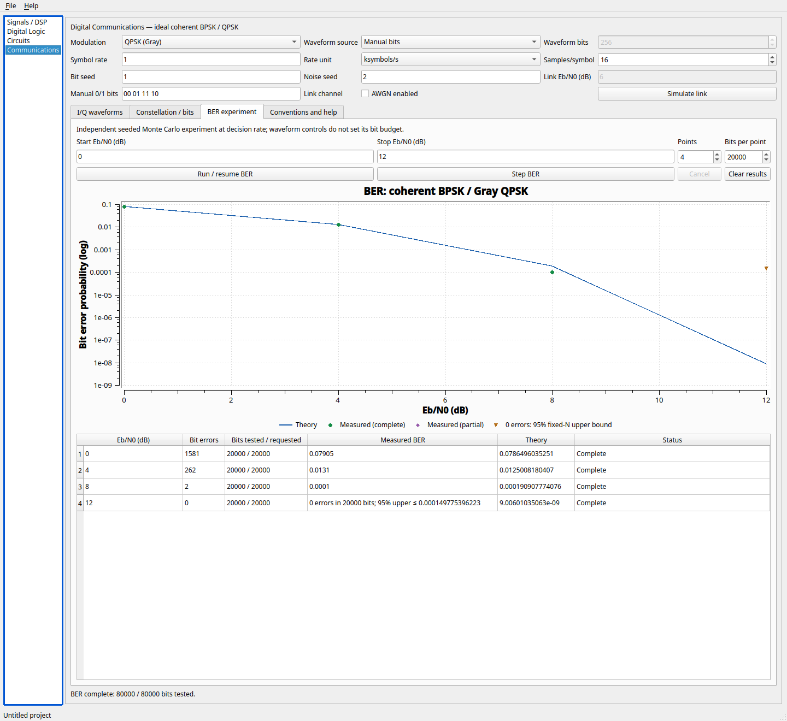

# Workbench screenshots

These are actual 1.0.1 workbench renders on Fedora 44, Qt 6.11.2, at 100%
scaling, 1440×1320, using Qt's offscreen platform. They include the final v1 focus, Signals layout and BER legend/table fixes.
They are not mockups or evidence
of physical Windows/mixed-DPI validation. The test loads each example snapshot
into an unnamed workspace, explicitly computes, then captures the window. Ordinary
File → Open additionally displays the filename/path. No analysis runs on restore.



**Signals / DSP:** 40 Hz, 127-tap FIR passes the 20 Hz tone. The filtered record has
1150 samples and 61.5234375 ms delay. Spectra use independent record normalization.



**Timing:** the rising-edge DFF captures at 5 and 15 ns; Q arrives 1 ns later.
The output table and status complement the timing diagram.



**AC:** the RC low-pass sweeps across its 159.154943 Hz corner. A separate solve
at the corner gives 0.5−j0.5 V RMS, −3.0103 dB transfer and −45°.



**Communications:** the fixed-seed experiment tests 20000 bits at each of four
Eb/N0 points. A zero-error point is an observation with a 95% upper bound, not
zero true BER. Exact Gaussian rounding may vary across platform math libraries.

All required actions and numerical expectations are available as text in the
[first-session guide](first-session.md) and [example guide](../examples/README.md).

## Reproduce or update

From the repository after building `dev`:

```bash
QT_QPA_PLATFORM=offscreen QT_SCALE_FACTOR=1 OPENECE_EXAMPLE_SCREENSHOTS="$PWD/build/example-images" ./build/dev/tests/openece_example_gui_tests examples
```

Review the generated images before copying only the four selected files to
`docs/images/`. Do not edit plot pixels or use screenshots as numerical tests.
For a native manual capture, open the matching file, perform its documented
operation, maximize/resize so controls and status are visible, capture the actual
window and record OS/Qt/scaling. Avoid dialogs containing personal paths. A new
screenshot must still be accompanied by textual instructions and useful alt text.
